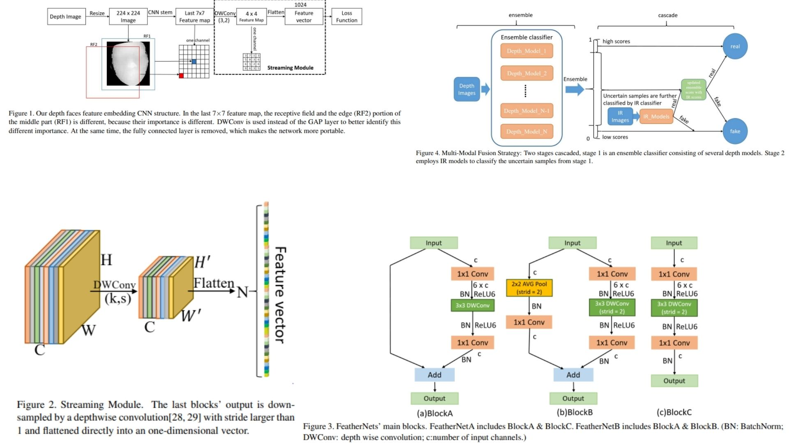

# 🪶 FeatherNet-Replication

This repository provides a **PyTorch replication** of the **FeatherNet architecture** for face anti-spoofing, focusing on building an ultra-light CNN designed for mobile and embedded environments. It reconstructs the full pipeline from the original paper, including the **Streaming Module , inverted residual blocks, lightweight downsampling strategies (BlockA/B/C), and multi-modal fusion design principles**.

Paper reference: *FeatherNets: CNNs as Light as Feather for Face Anti-spoofing*  https://arxiv.org/abs/1904.09290  

---

## Overview 🧭



> FeatherNet reduces model complexity by replacing heavy fully-connected / GAP-based pipelines with a **depthwise convolution based Streaming Module**, while maintaining discriminative power for face anti-spoofing tasks using depth-aware representations.

Key ideas:

- Ultra-light CNN (~0.35M params) for face anti-spoofing  
- Streaming Module replaces GAP/FC for feature aggregation  
- Depthwise conv used for efficient spatial encoding  
- Non-uniform spatial importance (center > edges)  
- Two variants: FeatherNet-A (fast) / FeatherNet-B (accurate)  

---

## Core Math 📐

**Depthwise Streaming Convolution:**

$$
FV_n(y,x,m) = \sum_{i,j} K_{i,j,m} \cdot F_{IN_y(i),IN_x(j),m}
$$

**Flatten indexing:**

$$
n(y,x,m) = m \cdot H' \cdot W' + y \cdot H' + x
$$

**Input mapping:**

$$
IN_y(i) = y \cdot S_0 + i, \quad IN_x(j) = x \cdot S_1 + j
$$

---

## Why FeatherNet Matters 🧬

- Removes inefficiency of **Global Average Pooling assumption of equal spatial importance**
- Introduces **learned spatial weighting via depthwise convolution**
- Achieves strong performance with extremely low computational cost
- Designed for **real-time face anti-spoofing on edge devices**
- Provides a practical trade-off between accuracy and latency (A vs B variants)

---

## Repository Structure 🏗️

```bash
FeatherNet-Replication/
├── src/
│   ├── blocks/
│   │   ├── inverted_residual.py
│   │   ├── downsample_b.py
│   │   ├── downsample_c.py
│   │   └── se_module.py
│   │
│   ├── streaming/
│   │   ├── dwconv_stream.py
│   │   └── flatten.py
│   │
│   ├── modules/
│   │   ├── feather_stage.py
│   │   └── downsample_stem.py
│   │
│   ├── model/
│   │   ├── feathernet_a.py
│   │   └── feathernet_b.py
│   │
│   └── config.py
│
├── images/
│   └── figmix.jpg
│
├── requirements.txt
└── README.md
